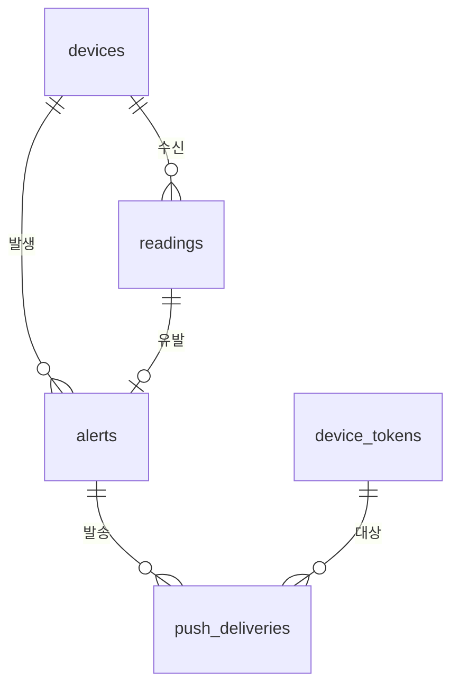

# DB 스키마 설계

대상: EV 배터리 화재 조기감지 백엔드. SQLite + SQLAlchemy 2.0 + Alembic.
호스트: Raspberry Pi Zero 2W (512MB). 단일 writer(LoRa 수신 task) + 다중 reader(API).

## 설계 전제

| 항목 | 값 | 근거 |
|---|---|---|
| 판정 위치 | 노드(ESP32) | `gas-detection-algorithm-design.md` 상태기계가 노드에 있음. 서버는 기록·디스패치만 |
| 노드 단위 | 차량 1대 = 노드 1개 | 인터뷰 확정. 차량 테이블 분리 없이 `devices`에 흡수 |
| 전송 트리거 | 상태 전이 시 즉시 + heartbeat | LoRa duty cycle 제약. 1Hz 원시 전송 불가 |
| heartbeat 주기 | 5분 (설정값, 펌웨어 확정 시 조정) | 스키마는 주기에 무관 |
| 페이로드 | 정규화(z-score) + slope만 전송. raw 미전송 | 인터뷰 확정. LoRa 대역폭 절약 |
| 튜닝 데이터 경로 | 벤치 시리얼 로거(USB 직결), DB 아님 | 파라미터 튜닝은 대역폭 제약이 없는 유선 경로에서 |
| 인증 | 미도입 | 개인식별정보 저장 안 함 (번호판 X) |

## ER



| 테이블 | 역할 | 증가 특성 |
|---|---|---|
| `devices` | 노드 등록·생존 상태. LoRa `hw_id` ↔ 내부 id 매핑 | 정적 (수십 행) |
| `readings` | 수신 프레임 전량. heartbeat 포함 | 노드당 288행/일 (5분 주기) |
| `alerts` | 상태 전이 이벤트 | 희소 |
| `device_tokens` | 앱 푸시 토큰 | 정적 |
| `push_deliveries` | 발송 시도·결과 | alert × 활성 토큰 수 |

## 핵심 결정

### D1. readings와 alerts 분리

조회 목적이 다르다. readings는 시간범위 스캔(추이 그래프), alerts는 활성 소수 행 조회(대응 대상). 한 테이블에 두면 알람 조회가 매번 대용량 스캔이 된다.

### D2. readings에 `state` 유지 (중복 아님)

`state`는 alerts에서 유도한 값이 아니라 노드가 프레임에 실어 보낸 **원본 수신값**이다. alerts가 readings의 요약이지 그 반대가 아니다.

- 오경보 분석: "ALARM 직전 20분 추이"가 단일 테이블 시간범위 스캔으로 해결
- 전이 감지 로직에 버그가 있어도 readings로 재구성 가능
- 전이 없이 유지된 구간(WATCH 40분)은 전이 이벤트만으로 표현 불가

### D3. 정규화값만 저장 (raw 미저장)

노드가 정규화값만 보낸다. LoRa는 실효 수 kbps + duty cycle 규제라 페이로드가 곧 비용이고, raw는 무선으로 나를 가치가 낮다.

- `*_dev` — baseline 대비 z-score. 가스 방향이 양수(VOC는 부호 반전 적용된 값)
- `*_slope` — dev 변화율 (z/min). 승격 판정 근거

**파라미터 재튜닝용 raw는 DB가 아니라 벤치 시리얼 로거에서 나온다.** 알고리즘 파라미터(`α_base`, `S_watch`, `T_hold` 등)는 전부 벤치 실측 튜닝 대상인데, 그 작업은 노드를 USB로 직결한 상태에서 한다 — 대역폭 제약이 없는 경로다. 무선으로 raw를 올려 DB에 쌓는 건 같은 데이터를 비싼 경로로 중복 수집하는 것.

**대가**: DB에 쌓인 과거 이력으로 새 임계값을 소급 검증할 수 없다. 임계값을 바꾸면 그 시점 이후 데이터만 새 기준이 적용된다. 소급 검증이 필요해지면 벤치 로그를 별도 보관·분석한다.

### D4. 측정값은 wide 스키마

채널 집합을 바꾸는 주체가 개발자이고, 변경이 LoRa 프레임 version 증가·펌웨어 재플래싱과 동반된다. narrow(EAV)가 아껴주는 건 그 체인의 마지막 조각인 `ALTER TABLE ADD COLUMN` 한 줄뿐인데, SQLite의 ADD COLUMN은 기존 행을 재작성하지 않아 사실상 무료다.

narrow가 무는 비용: 행 수 5~7배, pivot 조회, 단일 `value` 컬럼에 서로 다른 단위 혼재(채널별 CHECK 불가), 도메인 모델이 `dict[str, float]`가 되어 mypy strict 무의미화.

**narrow로 뒤집는 조건** (충족되면 재설계):
1. 노드 하드웨어 구성이 2종 이상으로 갈려 채널 희소성이 커질 때
2. 채널을 앱·운영에서 런타임 등록해야 할 때
3. 채널 수가 15개를 넘을 때

### D5. 시각은 TEXT ISO8601 UTC

SQLAlchemy `DateTime(timezone=True)`는 SQLite에서 타임존을 보존하지 못한다(SQLite에 tz 타입 없음). aware datetime을 넣고 꺼내면 naive로 돌아온다.

→ `'2026-08-08T12:34:56.789Z'` 형식 TEXT로 저장한다. 사전순 정렬 = 시간순 정렬이고, Pi에서 `sqlite3` CLI로 직접 볼 때 읽힌다. aware datetime 복원은 repository 변환 지점에서만 한다.

epoch INTEGER가 더 compact하지만(행당 ~34바이트 절약), 프로토타입 단계에서 Pi에 SSH 붙어 raw 조회하는 디버깅 빈도가 높아 가독성을 택했다.

### D6. 노드 시각과 서버 시각 분리 저장

`measured_at`(노드 기준)과 `received_at`(서버 기준)을 둘 다 남긴다. 노드 RTC는 신뢰할 수 없고, 두 값의 차이가 노드 시계 이상·전송 지연의 유일한 관측 수단이다. 조용히 보정하지 않는다.

### D7. `devices`의 의도적 비정규화

`last_seen_at`, `last_seq`, `last_state`는 readings에서 유도 가능하다. 그럼에도 두는 이유:

- "무응답 장비 찾기" 헬스체크가 작은 `devices` 테이블 스캔으로 끝난다. 유도하면 readings 상관 서브쿼리
- seq 유실 판정에 직전 seq가 프레임마다 필요 — 조회 대신 갱신 1회
- 갱신 주체가 단일 writer라 정합성 위험이 낮다

## DDL

```sql
-- 노드 (차량 1대 = 노드 1개)
CREATE TABLE devices (
    id               INTEGER PRIMARY KEY,
    hw_id            TEXT    NOT NULL UNIQUE,   -- LoRa 프레임 device_id (MAC 하위 hex)
    label            TEXT    NOT NULL,          -- 표시명 "1호차"
    parking_slot     TEXT,                      -- "B2-14"
    firmware_version TEXT,
    frame_version    INTEGER,                   -- 마지막 수신 프레임 version
    is_active        INTEGER NOT NULL DEFAULT 1,
    registered_at    TEXT    NOT NULL,
    -- 비정규화 (D7)
    last_seen_at     TEXT,
    last_seq         INTEGER,
    last_state       TEXT
);

-- 수신 프레임 전량
CREATE TABLE readings (
    id            INTEGER PRIMARY KEY,
    device_id     INTEGER NOT NULL REFERENCES devices(id),
    seq           INTEGER NOT NULL,
    measured_at   TEXT    NOT NULL,             -- 노드 기준 UTC ISO8601
    received_at   TEXT    NOT NULL,             -- 서버 기준 UTC ISO8601
    frame_version INTEGER NOT NULL,
    state         TEXT    NOT NULL
                  CHECK (state IN ('WARMUP','NORMAL','WATCH','ALARM','FAULT')),

    -- 가스 채널: 정규화 / 변화율 (D3, raw 미저장)
    voc_dev       REAL,                         -- SGP40. z-score, 가스방향 양수
    voc_slope     REAL,                         -- z/min
    h2_dev        REAL,                         -- MQ-8
    h2_slope      REAL,
    co_dev        REAL,                         -- MQ-7
    co_slope      REAL,

    -- 환경·구조 채널
    temp_c         REAL CHECK (temp_c IS NULL OR temp_c BETWEEN -40 AND 125),
    humidity_pct   REAL CHECK (humidity_pct IS NULL OR humidity_pct BETWEEN 0 AND 100),
    pressure_hpa   REAL,                        -- 모듈 팽창 감지
    water_level_mm REAL,                        -- 침수 감지

    -- 통신 품질
    rssi          INTEGER CHECK (rssi IS NULL OR rssi <= 0),
    snr           REAL,

    UNIQUE (device_id, measured_at, seq)        -- 재전송 멱등
);
CREATE INDEX ix_readings_device_time ON readings (device_id, measured_at DESC);

-- 상태 전이 이벤트
CREATE TABLE alerts (
    id                INTEGER PRIMARY KEY,
    device_id         INTEGER NOT NULL REFERENCES devices(id),
    reading_id        INTEGER REFERENCES readings(id),   -- 전이 유발 프레임
    from_state        TEXT NOT NULL,
    to_state          TEXT NOT NULL,
    occurred_at       TEXT NOT NULL,            -- 노드 기준
    detected_at       TEXT NOT NULL,            -- 서버 기준
    acknowledged_at   TEXT,                     -- NULL = 활성
    acknowledged_note TEXT
);
CREATE INDEX ix_alerts_device_time ON alerts (device_id, occurred_at DESC);
CREATE INDEX ix_alerts_active ON alerts (device_id) WHERE acknowledged_at IS NULL;

-- 앱 푸시 토큰
CREATE TABLE device_tokens (
    id                 INTEGER PRIMARY KEY,
    token              TEXT NOT NULL UNIQUE,    -- 멱등 등록
    platform           TEXT NOT NULL CHECK (platform IN ('android','ios')),
    registered_at      TEXT NOT NULL,
    last_used_at       TEXT,
    is_active          INTEGER NOT NULL DEFAULT 1,
    deactivated_reason TEXT                     -- UNREGISTERED / INVALID_ARGUMENT
);

-- 발송 시도 이력
CREATE TABLE push_deliveries (
    id         INTEGER PRIMARY KEY,
    alert_id   INTEGER NOT NULL REFERENCES alerts(id),
    token_id   INTEGER NOT NULL REFERENCES device_tokens(id),
    attempt    INTEGER NOT NULL,
    status     TEXT NOT NULL
               CHECK (status IN ('pending','sent','failed_retryable','failed_permanent')),
    error_code TEXT,
    sent_at    TEXT
);
CREATE INDEX ix_push_deliveries_alert ON push_deliveries (alert_id);
```

## 인덱스 근거

| 인덱스 | 지원 쿼리 |
|---|---|
| `ix_readings_device_time` | "장비 X 최근 N시간 추이" — 앱 그래프의 주 쿼리 |
| `UNIQUE(device_id, measured_at, seq)` | 재전송 멱등 upsert. `seq` 랩어라운드 대비 `measured_at` 포함 |
| `ix_alerts_active` (부분 인덱스) | "현재 대응 필요한 알람" — 이력 크기와 무관하게 유지 |
| `ix_alerts_device_time` | 장비별 알람 이력 |
| `ix_push_deliveries_alert` | 알람별 발송 결과 조회 |

## 용량 추산

행 크기 ~170B(TEXT 시각 2개 + REAL 10개) + 인덱스.

| 조건 | 일 | 년 |
|---|---|---|
| 10노드 × 5분 주기 | 2,880행 / ~0.5MB | ~105만행 / ~230MB |
| 10노드 × 1분 주기 | 14,400행 / ~2.4MB | ~525만행 / ~1.2GB |

5분 주기면 SD카드에서 문제없다. 1분 주기로 가면 retention이 필요해진다.

## Retention (미결정 — 결정 조건 명시)

- `alerts`, `push_deliveries` — 영구 보존. 희소하고 사후 분석 가치가 높다
- `readings` — 삭제 대상 후보. 아래 조건 중 하나라도 걸리면 정책을 정한다
  1. DB 파일이 SD카드 여유 공간의 30%를 넘을 때
  2. heartbeat 주기를 1분 이하로 낮출 때
  3. 노드 수가 20개를 넘을 때
- 삭제 시 ALARM/WATCH 구간 전후 데이터는 보존한다 — 오경보 분석의 원본이다

## 미도입 (지금 안 넣는 것과 이유)

| 항목 | 이유 | 도입 조건 |
|---|---|---|
| raw 센서값 (`*_raw`) | LoRa 대역폭 비용 대비 가치 낮음. 튜닝은 벤치 시리얼 경로 (D3) | 무선 구간에서만 재현되는 이상을 raw로 봐야 할 때 |
| `baseline`·`sigma` 컬럼 | 프레임 크기 부담. dev+slope로 대부분 분석 가능 | 벤치에서 baseline 드리프트 자체를 추적해야 할 때 |
| 대응 대상 9종 테이블 | 시연은 패널 디스플레이로 대체 | 실제 외부 연동(소방서·주차장 시스템) 착수 시 |
| 사용자·차주 테이블 | 인증 미도입 | 인증 도입과 동시 |
| 롤업/집계 테이블 | 5분 주기에서 원본 스캔으로 충분 | 1분 주기 전환 또는 조회 지연 체감 시 |
| 팩⊃모듈⊃셀 계층 | 노드 1개 = 차량 1대 구조 | 차량당 모듈별 노드 다중화 시 |
